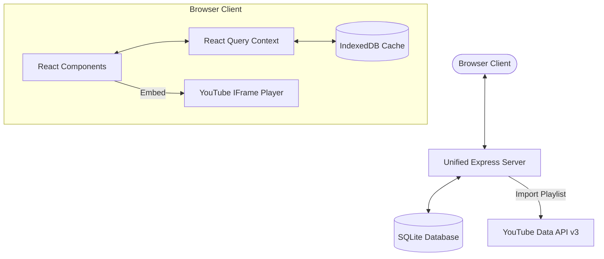
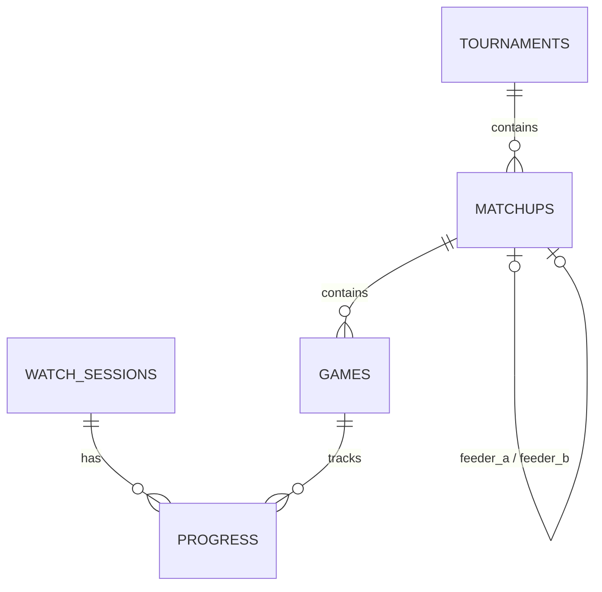

# System Design: Spoiler-Free Tournament Viewer

This document outlines the technical design, domain model, database schema, and deployment architecture for the Spoiler-Free Tournament Viewer. The application is a self-hostable, deployable web app that lets users catch up on tournament-style competitions (such as the NBA Playoffs, FIFA World Cup, or Esports brackets) in chronological order without spoiling matchup lengths or outcomes.

---

## 1. System Architecture

The application is structured as a monorepo containing a Node.js + Express backend and a Vite + React frontend.

### Key Architectural Choices
- **Unified Single-Service Runtime**: In production, the React frontend is compiled to static files (`dist/`) and served directly by the Express server. This packages the entire application into a single Node.js process, eliminating CORS configurations and simplifying deployment.
- **SQLite Storage**: A file-based SQLite database is used for storing tournament records, parent-child matchup links, and user watch sessions. This makes the app lightweight, serverless, and highly portable.
- **IndexedDB + React Query Cache**: Browser-side client state is managed via React Query and cached inside the browser's IndexedDB (using `localforage`). This provides extremely fast load times and enables offline-first tracking.

---

## 2. Domain Model & Vocabulary

Our codebase aligns with the domain language defined in `CONTEXT.md`:
- **Tournament**: The overall competition (e.g. NBA Playoffs 2025-26, FIFA World Cup 2026).
- **Stage**: A phase of the tournament (e.g. Group Stage, Knockout Bracket).
- **Matchup**: A head-to-head contest between two contenders/teams in a Stage, consisting of one or more Games (e.g., best-of-7 series in NBA, single-game knockout in World Cup).
- **Game**: A single contest within a Matchup (e.g. Game 3 of a Matchup).
- **Watch Session**: A unique record in the database tracking a user's progress. Sharing the session ID via the URL parameter (`?s=xyz`) syncs progress across devices.
- **Locked**: A Game is Locked (details blurred/hidden) until the previous Game in its Matchup enters a completed state.
- **Unlocked**: A Game is Unlocked and playable because its predecessor has been completed.
- **Unwatched / Watched / Skipped**: The completion states of a Game. Both `Watched` and `Skipped` act as completed states that unlock the subsequent Game.

---

## 3. Database Schema

The database is built on SQLite. The schema manages the relational bracket dependencies (feeders) and tracks user sessions.

### Table Definitions

#### `tournaments`
Stores the high-level tournament metadata and format.
- `id` (TEXT PRIMARY KEY): Unique identifier (e.g., `nba-playoffs-2026`).
- `title` (TEXT): Display name.
- `description` (TEXT): Subtitle or overview.
- `type` (TEXT): format type (`'bracket'` or `'timeline'`).
- `created_at` (DATETIME DEFAULT CURRENT_TIMESTAMP).

#### `matchups`
Defines a series between two contenders. Supports parent-child bracket dependencies.
- `id` (TEXT PRIMARY KEY): Unique identifier.
- `tournament_id` (TEXT, FK): Reference to `tournaments`.
- `title` (TEXT): E.g., "Knicks vs Spurs".
- `stage_name` (TEXT): E.g., "NBA Finals", "Quarterfinals".
- `sequence` (INTEGER): Sorted order of matchups in the Stage.
- `feeder_a_id` (TEXT, FK, NULL): The preceding matchup that supplies contender A.
- `feeder_b_id` (TEXT, FK, NULL): The preceding matchup that supplies contender B.

#### `games`
Represents an individual game/video within a matchup.
- `id` (TEXT PRIMARY KEY): Unique identifier.
- `matchup_id` (TEXT, FK): Reference to `matchups`.
- `game_number` (INTEGER): E.g., 1, 2, 3... 7.
- `title` (TEXT): Full game video title.
- `team_a` (TEXT), `team_b` (TEXT): Names of competitors.
- `date` (TEXT): ISO 8601 string of when the game occurred.
- `video_id` (TEXT): YouTube 11-character Video ID.
- `duration` (TEXT): Run length text.

#### `watch_sessions`
Tracks anonymous user instances to support synchronization and sharing.
- `id` (TEXT PRIMARY KEY): Random unique ID (e.g. NanoID or UUID).
- `created_at` (DATETIME DEFAULT CURRENT_TIMESTAMP).

#### `progress`
Maps user sessions to their game completion states.
- `id` (INTEGER PRIMARY KEY AUTOINCREMENT).
- `session_id` (TEXT, FK): Reference to `watch_sessions`.
- `game_id` (TEXT, FK): Reference to `games`.
- `status` (TEXT): `'watched'` or `'skipped'`.
- `updated_at` (DATETIME DEFAULT CURRENT_TIMESTAMP).

---

## 4. Key Feature Implementation Details

### A. Spoiler-Free Bracket Resolution (TBD Matchups)
In bracket views, matchups in later rounds depend on earlier rounds.
- **API Resolution**: When serving `GET /api/tournaments/:id`, the server queries the database. If a matchup's feeder matchups are incomplete (neither team has won the required games), the server replaces the contenders in the response payload with placeholders (`"Winner of Matchup X"`).
- **Client Rendering**: The `BracketView` renders the placeholder teams. Clicking the matchup shows it as Locked, hiding the game list and prevent any data leaks.

### B. Dynamic Timeline
- **Concept**: Users can watch all games in order of calendar date.
- **Logic**: The UI requests the chronological schedule. Instead of loading the full list, the client filters the timeline:
  - If a game is Watched or Skipped, it remains visible on the timeline.
  - If a game is Unwatched but Unlocked, it is displayed (accessible for playback).
  - If a game is Locked, it is entirely omitted from the timeline.
  - As a user finishes playing a game, the next game in that matchup dynamically "reveals" itself on the timeline in its correct chronological slot.

### C. Sequential Lock/Unlock Flow
- Inside a `MatchupDetails` panel:
  - Only games up to the first `Unwatched` game are visible/playable.
  - Game $N$ is only revealed if Game $N-1$ has status `'watched'` or `'skipped'`.
  - The total number of games in active series is completely hidden from the UI to avoid spoiling matchup duration (e.g., if a series has 5 games, and the score is 3-1, knowing game 5 is the last game spoils the result).

### D. Playback & State Persistence
- **YouTube IFrame API**: The video plays in a custom player modal. The wrapper binds to the player's status changes:
  - When state goes to `ENDED` (code `0`), it triggers a React Query mutation.
  - The mutation updates the browser's IndexedDB progress record and performs a POST sync to `/api/sessions/:id/progress` on the server.
- **Manual Progress**: A toggle button is provided next to the player, letting the user manually cycle a game between `Unwatched`, `Watched`, or `Skipped`.

### E. URL-Based Watch Sessions
- When a user first visits, the client checks `localStorage` or the URL parameter `?s=`.
- If no session ID is found, it calls `POST /api/sessions` to register a new session, saving it to `localStorage` and pushing it to the URL history.
- Sharing the link (e.g., `http://domain.com/?s=abc`) loads the exact database progress. An option in the settings panel allows the recipient to click "Clone Session", creating a new database session copying all progress records.

### F. Playlist Importer & Templates
- Admins can import playlists dynamically by setting a `YOUTUBE_API_KEY` and submitting a request to the backend.
- The importer processes pages of `playlistItems` from the YouTube Data API.
- Importer configurations use **Templates** (regex patterns):
  - *NBA Playoffs Preset*: Matches `#<Seed> <TeamA> at #<Seed> <TeamB> | <Round> GAME <N> HIGHLIGHTS`.
  - *Generic Matchup Preset*: Matches `<TeamA> vs <TeamB> | <Stage> - Game <N>`.
- The parser merges duplicate games (favoring titles starting with `EXTENDED:` or longer durations) and builds the matchups.

---

## 5. Build & Deployment Architecture

### Docker Build Pipeline
The application uses a multi-stage Docker build, producing a lightweight runtime image:
1. **Build Stage**: Installs development dependencies, copies code, and runs `npm run build` (creating static assets).
2. **Runner Stage**: Installs production dependencies only, copies Express server files and build assets, exposes port `3000`, and exposes a volume mount at `/data` for the SQLite file.

### Local Development
To run in development mode locally:
- Server runs on `http://localhost:3001` (hot-reloaded).
- Vite dev server runs on `http://localhost:5173`, proxying `/api` queries to the server.
- SQLite runs locally in `./database.sqlite`.

---

## 6. Implementation Phased Roadmap

1. **FR-01: Backend Foundation & SQLite Schema**: Database setup, tables migration, and seed scripts.
2. **FR-02: Backend API Endpoints & Session Management**: REST endpoints and TBD resolution logic.
3. **FR-03: YouTube Playlist Importer Service**: Playlist crawlers and regex templates parser.
4. **FR-04: Frontend Base Setup, IndexedDB, & React Query**: State synchronization and persistence hooks.
5. **FR-05: Bracket View, Timeline View, & Spoiler-Free UI**: Visual bracket rendering, Dynamic Timeline filters, and CSS styling.
6. **FR-06: YouTube Video Player & Manual Skip Controls**: Embed API listeners and skip buttons.
7. **FR-07: Docker Containerization & Deployment Orchestration**: Docker configs and static files integration.
